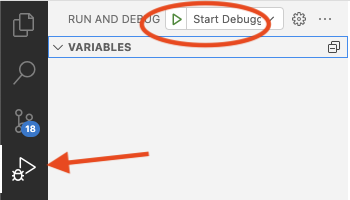
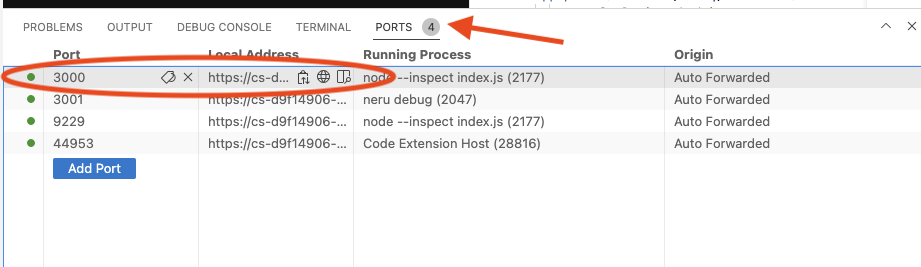

# Click to Call

This project shows how to add a button to allow for visitors to your website to quickly get in touch using the Voice API.

To start debugging the project, open the "Run and Debug" menu on the left side. Then start the debugger by clicking the play button.



In the bottom panel open the "Ports" then choose the link for port 3000 to open the project in your browser and see the call button.



If you would like to deploy your project, in the bottom panel open the "Terminal" and run the deploy command

```
vcr deploy
```

View the [deploying guide](https://developer.vonage.com/vcr/guides/deploying) to learn more about deploying on Vonage Cloud Runtime.